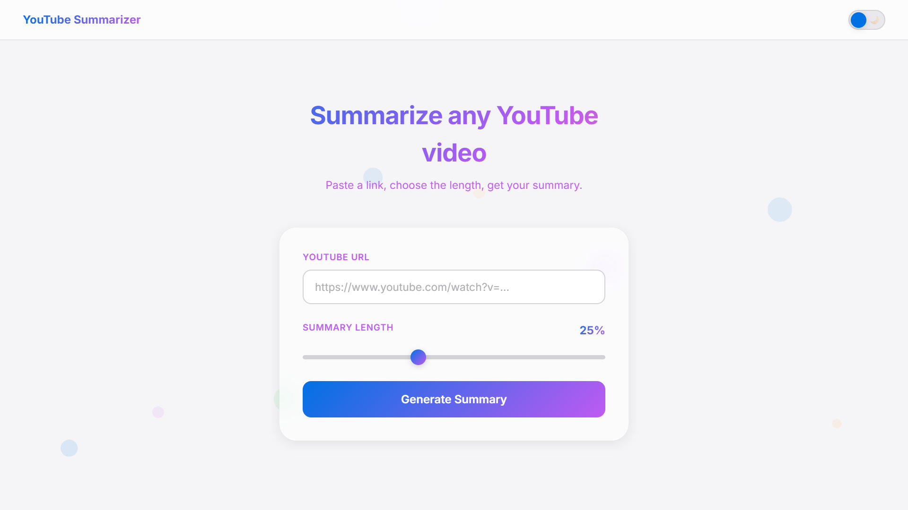
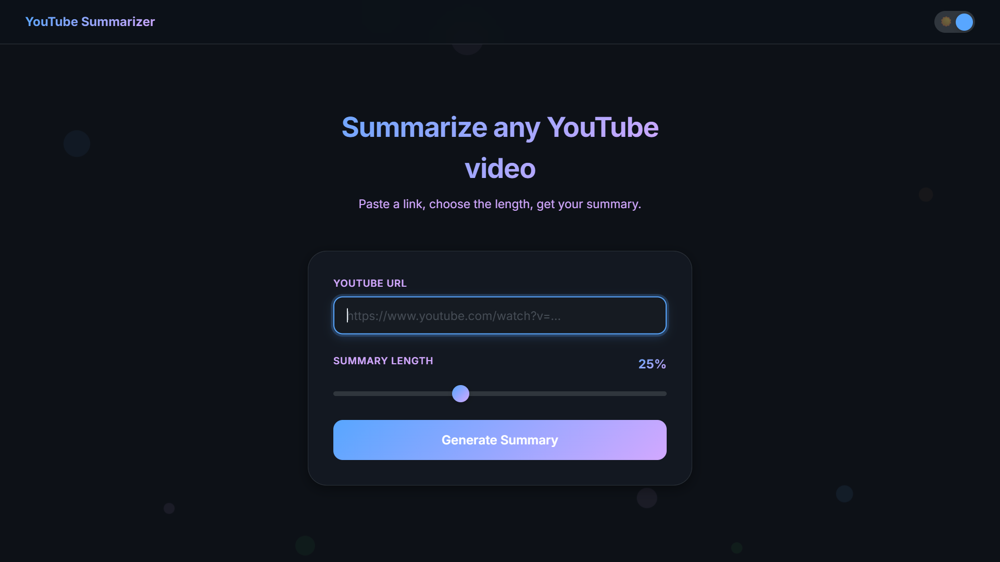
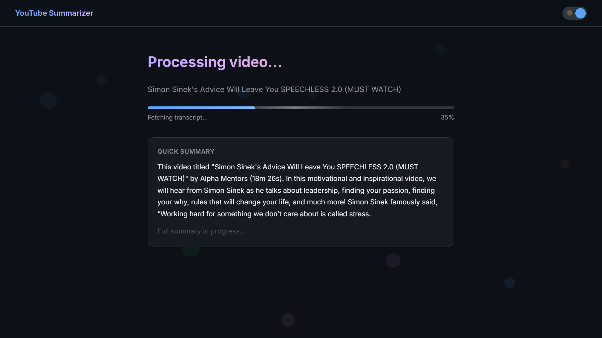
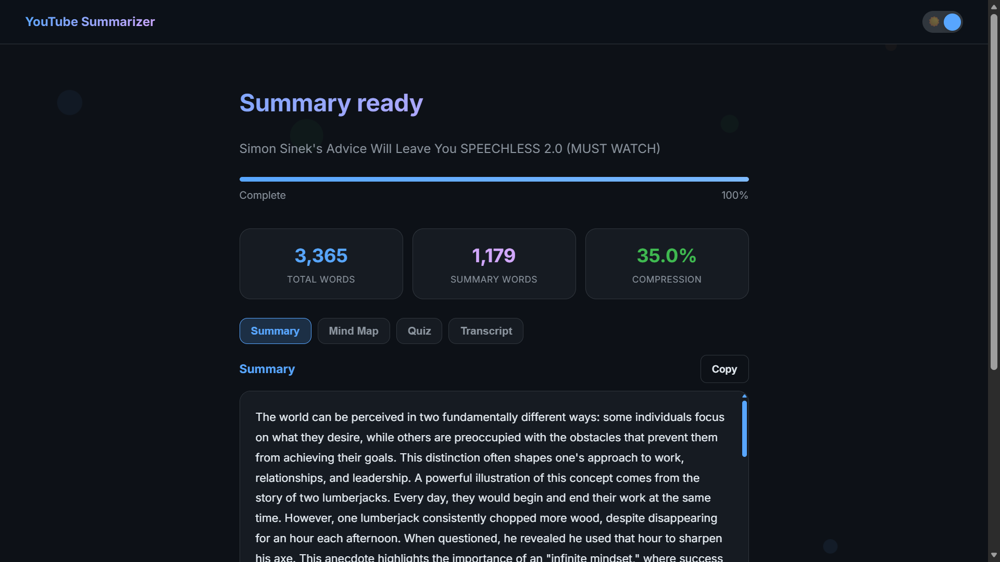
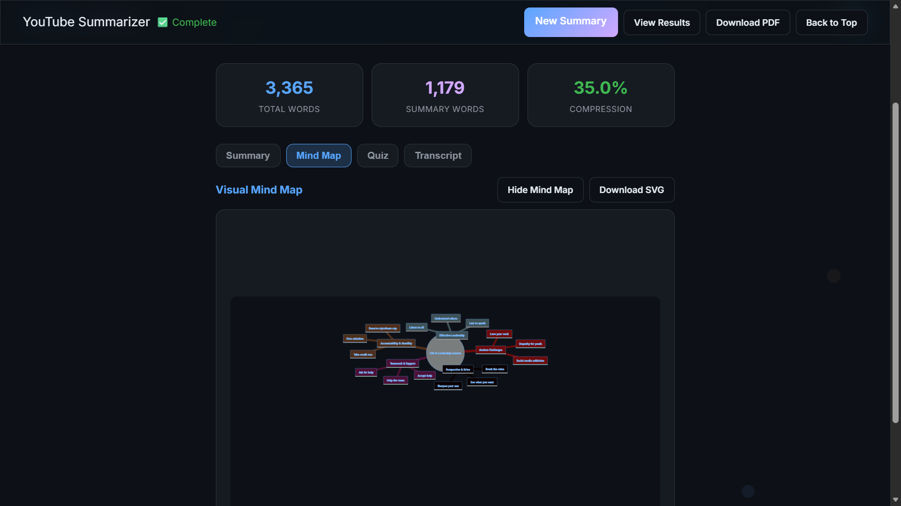
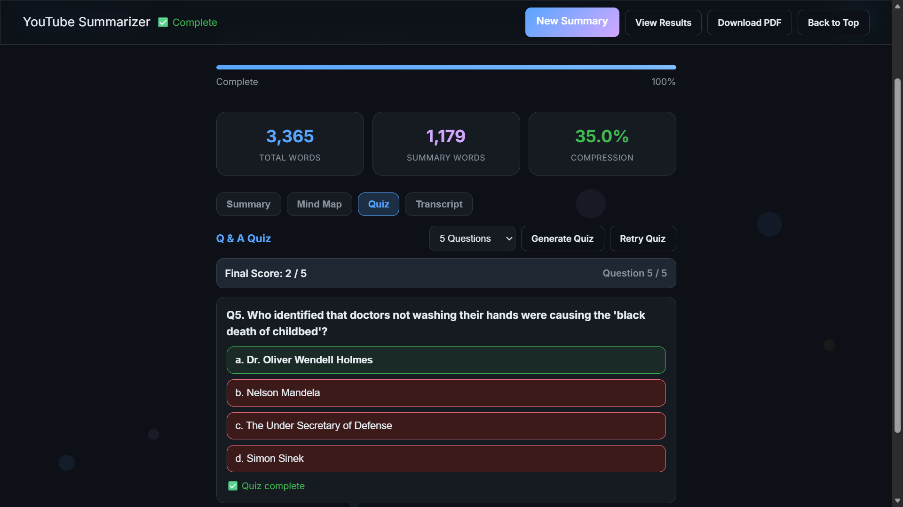
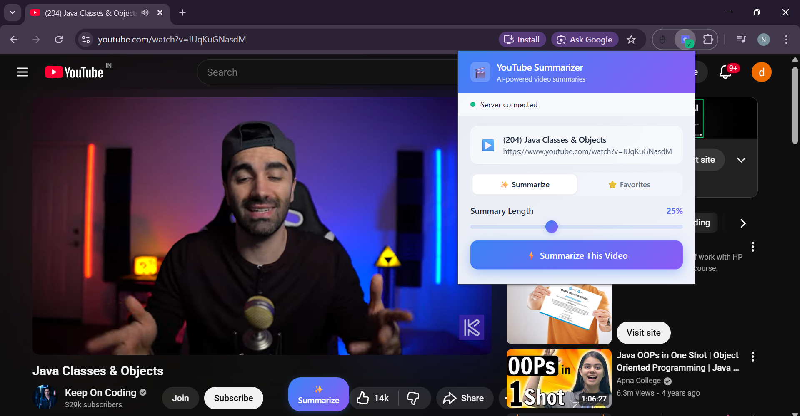
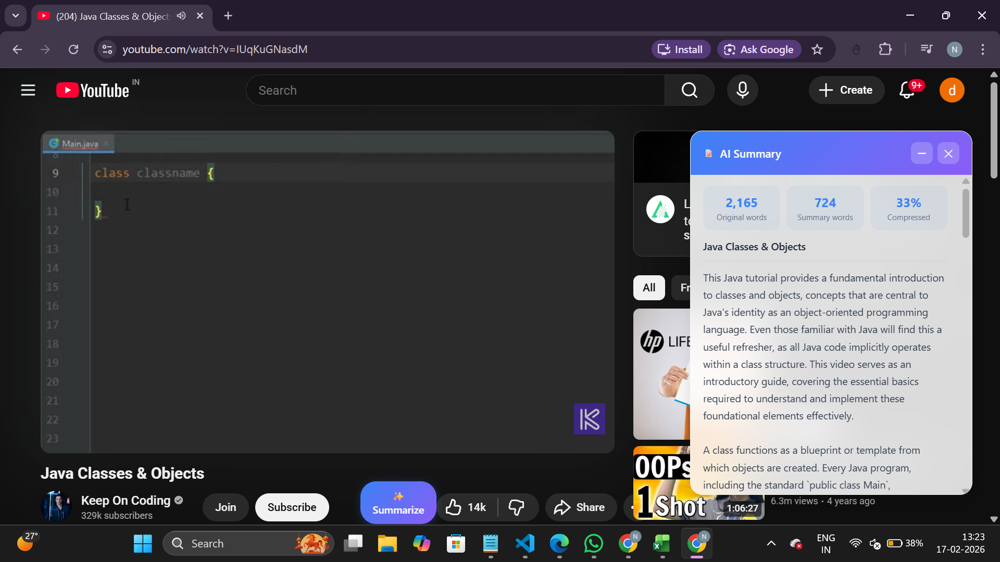

# YouTube AI Analyzer

An end-to-end YouTube analysis platform that converts video content into:

- focused summaries with adjustable compression
- Mermaid mind maps
- quiz questions for active recall

The project includes:

- a Flask web app with live processing updates (Socket.IO)
- a Chrome extension for one-click summarization from YouTube pages
- transcript-first extraction with robust fallbacks
- SQLite-based caching for faster repeat requests

## Demo Video

Full demo video (recently added): [Screen_shots/demo_video.mp4](Screen_shots/demo_video.mp4)

## What It Does

Given a YouTube URL, the app:

1. Validates the URL and extracts the video ID.
2. Checks cache for an existing summary for the same video plus summary percentage.
3. Fetches video metadata (title, description, duration, channel, etc.).
4. Attempts transcript extraction.
5. Falls back to audio download and speech-to-text if transcript is unavailable.
6. Uses Gemini to generate summary output.
7. Optionally generates a Mermaid mind map and MCQ quiz from transcript text.

## Key Features

- Adjustable summary length from 10% to 50%
- Real-time progress updates via WebSocket events
- Multi-model Gemini fallback chain for resiliency
- Transcript API first, then subtitle extraction, then audio transcription fallback
- Intelligent cache keyed by video plus summary ratio
- Cache TTL, max entry, and DB size controls
- Mind map sanitation and fallback rendering for Mermaid stability
- Quiz generation with strict JSON validation and safe fallback question builder
- Chrome extension popup with favorites and copy-to-clipboard support

## Architecture Overview

### Backend

- [main.py](main.py)
: Flask routes, Socket.IO events, API endpoints, CORS headers
- [video.py](video.py)
: Core processing pipeline (metadata, transcript/audio extraction, summary/mindmap/quiz generation)
- [cache_manager.py](cache_manager.py)
: SQLite cache lifecycle, stats, cleanup, limits

### Frontend (Web App)

- [templates/index.html](templates/index.html)
: URL input + summary-length selection
- [templates/processing.html](templates/processing.html)
: Live progress, summary panel, transcript panel, mind map and quiz interactions
- [static/shared.css](static/shared.css), [static/mindmap.css](static/mindmap.css), [static/global.js](static/global.js)
: shared styles and behavior

### Chrome Extension

- [chrome-extension/manifest.json](chrome-extension/manifest.json)
- [chrome-extension/popup.html](chrome-extension/popup.html)
- [chrome-extension/popup.js](chrome-extension/popup.js)
- [chrome-extension/content.js](chrome-extension/content.js)

## Tech Stack

- Python 3.8+
- Flask + Flask-SocketIO
- Google Generative AI (Gemini)
- yt-dlp
- youtube-transcript-api
- SpeechRecognition + pydub (audio fallback)
- SQLite (cache)
- Vanilla HTML/CSS/JS + Mermaid

## Setup Guide

### 1. Prerequisites

- Python 3.8 or newer
- FFmpeg installed and available in PATH (recommended)
- Gemini API key from: https://aistudio.google.com/apikey

### 2. Clone and install

```bash
git clone https://github.com/Nandan-k-s-27/youtube-ai-analyzer.git
cd youtube-ai-analyzer
python -m venv venv
# Windows
venv\Scripts\activate
# macOS/Linux
source venv/bin/activate
pip install -r requirements.txt
```

Optional performance dependency:

```bash
pip install -r requirements_optional.txt
```

### 3. Configure environment

Copy [.env.example](.env.example) to `.env` and set values:

```env
GEMINI_API_KEY=your_gemini_api_key_here
FLASK_DEBUG=false
PORT=5000
SECRET_KEY=change_this_in_production

# Optional cache tuning
CACHE_TTL_DAYS=7
CACHE_MAX_ENTRIES=500
CACHE_MAX_SIZE_MB=100
```

### 4. Run app

```bash
python main.py
```

Open: `http://127.0.0.1:5000`

## API Reference

### Health

- `GET /health`

Response:

```json
{
    "status": "ok"
}
```

### Process Video

- `POST /api/process`

Request body:

```json
{
    "url": "https://www.youtube.com/watch?v=VIDEO_ID",
    "percentage": 25
}
```

Success response includes:

- `summary`
- `text` (transcript/transcribed text)
- `source` (`transcript`, `audio`, or `metadata`)
- `title`
- `cached`

### Generate Mind Map

- `POST /api/generate-mindmap`

Request body:

```json
{
    "text": "...transcript text...",
    "title": "Optional title"
}
```

### Generate Quiz

- `POST /api/generate-quiz`

Request body:

```json
{
    "text": "...transcript text...",
    "title": "Optional title",
    "num_questions": 5
}
```

Constraints:

- `num_questions` must be between 5 and 10

### Cache Endpoints

- `GET /api/cache/stats`
- `POST /api/cache/clear` with body `{ "days": 30 }`

## WebSocket Events (Processing Page)

Client emits:

- `start_processing` with `{ url, percentage }`

Server emits:

- `progress_update`
- `processing_complete`
- `processing_error`

Progress states used by the pipeline include:

- `checking_cache`
- `fetching_metadata`
- `generating_quick_summary`
- `quick_summary_ready`
- `fetching_transcript`
- `downloading_audio`
- `transcribing_audio`
- `using_metadata_fallback`
- `generating_full_summary`
- `complete`

## Chrome Extension Setup

1. Open `chrome://extensions/`
2. Enable Developer Mode
3. Click Load unpacked
4. Select the [chrome-extension](chrome-extension) folder

Notes:

- The extension currently points to hosted API base URL inside [chrome-extension/popup.js](chrome-extension/popup.js)
- For local development, change `API_BASE` to `http://127.0.0.1:5000`

## Cache Management

### Interactive cache utility

```bash
python manage_cache.py
```

This utility shows:

- database size
- entry count
- access statistics
- health indicators
- cleanup actions

### Schema reset utility

```bash
python reset_cache.py
```

Use this if you need to clear and recreate cache schema from scratch.

## Troubleshooting

### 1. `GEMINI_API_KEY not found`

- Confirm `.env` exists in project root
- Confirm key name is exactly `GEMINI_API_KEY`

### 2. FFmpeg missing errors

- Install FFmpeg and ensure it is available in PATH
- Or set `FFMPEG_BINARY` and `FFPROBE_BINARY`

### 3. YouTube bot protection / transcript unavailable

- Some videos can block transcript/audio extraction pathways
- The app may degrade to metadata-based fallback summary in those cases

### 4. Gemini quota or model availability issues

- The app uses a fallback model list (`gemini-2.5-flash`, `gemini-2.5-pro`, `gemini-2.0-flash`)
- If all fail, check API quota and model access in Google AI Studio

### 5. Large first response times

- First request for a new video is slower due to extraction + generation
- Repeated requests are faster due to cache hits

## Screenshots

### Web App








### Chrome Extension




## Project Structure

```text
videotext/
├── main.py
├── video.py
├── cache_manager.py
├── manage_cache.py
├── reset_cache.py
├── requirements.txt
├── requirements_optional.txt
├── templates/
│   ├── index.html
│   ├── processing.html
│   └── result.html
├── static/
│   ├── global.js
│   ├── shared.css
│   └── mindmap.css
├── chrome-extension/
│   ├── manifest.json
│   ├── popup.html
│   ├── popup.js
│   ├── content.js
│   ├── content.css
│   └── background.js
├── cache/
└── Screen_shots/
```

## Security and Deployment Notes

- Do not commit `.env` with real keys.
- In production, use a strong `SECRET_KEY`.
- Restrict CORS origins to trusted domains.
- Consider using Gunicorn/eventlet or gevent for production-grade Socket.IO hosting.

## License

MIT License. See [LICENSE](LICENSE).
